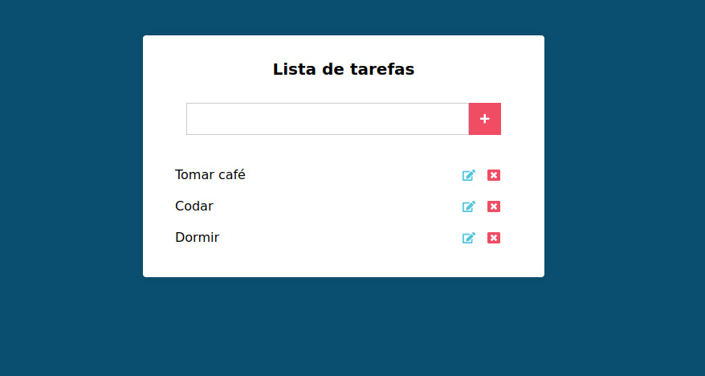

# Lista de Tarefas | To Do List

### Pré-requisitos

Antes de começar, você vai precisar ter instalado em sua máquina as seguintes ferramentas:
[Git](https://git-scm.com), [React.js](https://reactjs.org/), [Vite](https://vitejs.dev/).
Além disto é bom ter um editor para trabalhar com o código como [VSCode](https://code.visualstudio.com/)

### 🛠 Tecnologias

As seguintes ferramentas foram usadas na construção do projeto:

- [React.js](https://reactjs.org)
- [CSS3](https://www.tutorialrepublic.com/css-tutorial/)
